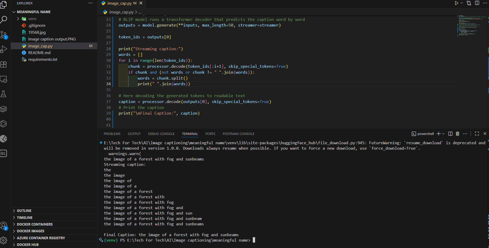

🖼️ AI Image Captioning App
📌 Overview

This project demonstrates how to build an AI-powered Image Captioning application that generates meaningful textual descriptions for images. It uses state-of-the-art vision-language models to bridge the gap between visual and textual data, making images more accessible, searchable, and engaging.

The project is part of IBM’s Building Generative AI-Powered Applications with Python course on Coursera, but it is designed to be adaptable for real-world business scenarios such as accessibility, SEO optimization, social media automation, and content discovery.

⚙️ Tech Stack

Python – Primary programming language for model integration and app logic.

PyTorch – Deep learning backend to run the BLIP (Bootstrapping Language-Image Pretraining) model.

Hugging Face Transformers – Provides access to BLIP, a pre-trained vision-language model capable of generating captions from images.

Gradio – User-friendly web interface to upload images and display generated captions.

PIL (Python Imaging Library) – For image loading and preprocessing.

📝 Key Takeaways from This Short Project

1. Built an end-to-end AI-powered Image Captioning app, not just a script.

2. Integrated Hugging Face BLIP model (Salesforce/blip-image-captioning-base) with PyTorch backend.

3. Learned the full pipeline: image preprocessing → model inference → text decoding → user display.

4. Extended functionality with word-by-word caption streaming to enhance user experience.

5. Practiced real-world AI product integration: taking a pre-trained model and adapting it into a working application.

🎯 Problem Statement

Images contain rich information but are invisible to machines and search engines without descriptions. This makes it hard to use them in accessibility, SEO, content discovery, or automation.

🛠️ My Approach

1. Used Hugging Face Transformers to load a pre-trained BLIP model.

2. Processed raw images with AutoProcessor and PIL into tensors.

3. Ran the model to generate captions word by word using BlipForConditionalGeneration.

4. Experimented with incremental output streaming for better UX.

5. Packaged everything into a Python application that can scale to different real-world use cases.

💡 Highlighting the Value

1. Accessibility: Descriptions for visually impaired users.

2. E-commerce: Auto product descriptions improve SEO & reduce manual work.

3. Social media & marketing: Auto captions for faster, more engaging content.

4. Research & archiving: Tagging and cataloging large datasets of images.

5. Security: Real-time descriptive monitoring from video feeds.

🚀 My Experience

This lab was more than just an assignment—it was my hands-on entry into multimodal generative AI.

1. I learned how to integrate state-of-the-art models into real applications.

2. Saw firsthand how preprocessing, model inference, and decoding fit together.

3. Extended the lab by adding streaming word-by-word captions, showing initiative beyond the baseline requirements.

4. Most importantly, I gained insight into how AI features translate into business value, which is crucial for modern software engineering.

⚡ Installation & Usage

🎇 Clone the repo:

    git clone https://github.com/your-username/ai-image-captioning.git
    cd ai-image-captioning

🎇 Create a virtual environment & install dependencies:

    python -m venv venv
    source venv/bin/activate  # (Linux/Mac)
    venv\Scripts\activate     # (Windows)
    pip install -r requirements.txt

🎇 Run the captioning script:

    python image_cap.py

Upload/replace your image in the script path and see the generated caption.

🖼️ Example Output

🔮 Future Improvements

1. Add multilingual caption support for global audiences.

2. Integrate with Gradio UI for a browser-based demo.

3. Extend to batch processing for datasets of thousands of images.

✨ With this project, I showcased how to move from model research to real-world AI product engineering, a critical skill in today’s software engineering industry.